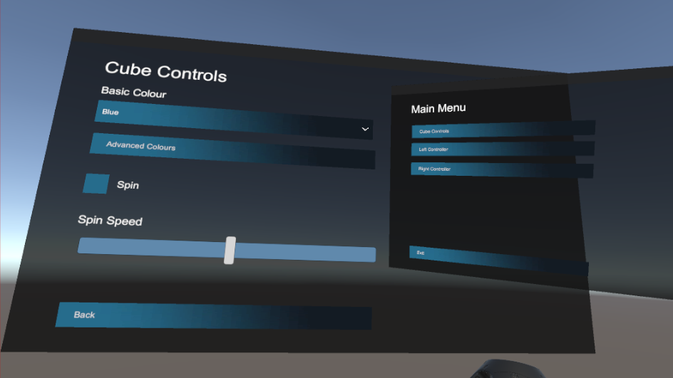
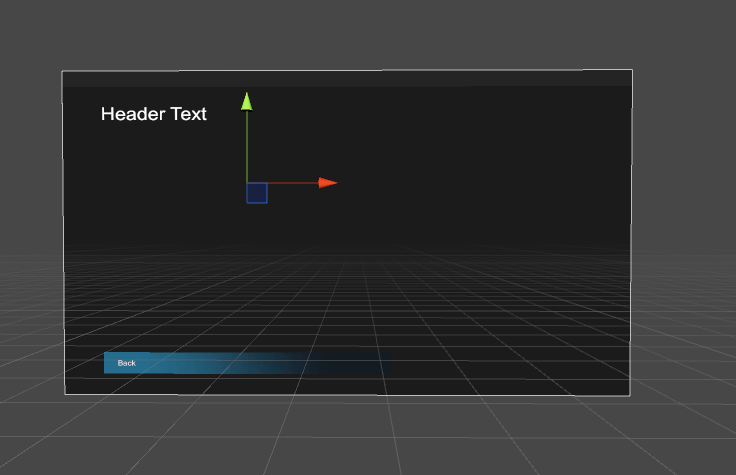
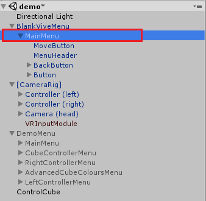
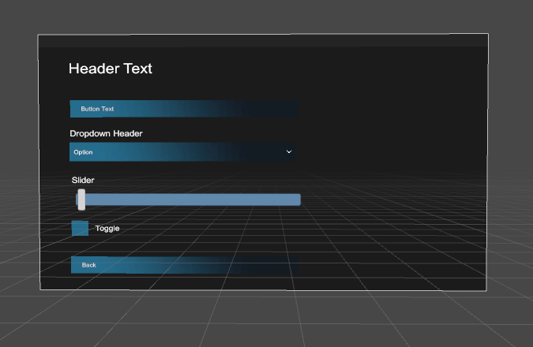
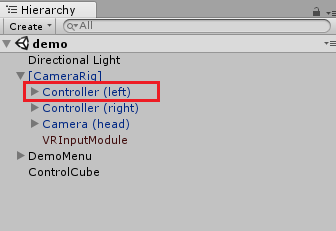

# ViveMenuToolkit
The Vive Menu toolkit is intended to allow developers to easily import menus into HTC vive projects in Unity. It uses a modified version of the input module from [VRInputModule](https://github.com/wacki/Unity-VRInputModule).



# Getting Started

**Running the demo**

- Download the zip file of this repository
- Extract the contents of the zip to a folder.
- Open Unity and select open project.
- Select ViveMenuToolkit-master.
- Select File > Open Scene.
- Select ViveMenuToolkit > demo.unity

The demo scene has several menus and a objects to demonstrate the main features of of the toolkit.

# Creating a new menu

**Creating a blank menu**

- Open the demo scene with File > Open Scene > ViveMenuToolkit > demo.scene
- In the project explorer, navigate to the prefabs folder in ViveMenuToolkit > Prefabs
- Drag and drop a BlankViveMenu onto the scene:



- You can edit the header text as with any unity object.

**Dropping in new controls** 
- Select a Button, Slider, Dropdown or Toggle from the prefabs folder. 
- Drag the control onto the MainMenu object to make sure it is placed on the menu correctly:



Having dragged some prefab controls, you should have a useable menu:



**Moving menus** 

The BlankViveMenu has a bar along the top of the menu that can be used to drag and drop using the laser. The is using the DragDrop component and can be added to any button and used to move menus.

**Creating a controller menu**

There are two ways of controlling menu items: 
- Using the laser:

In laser mode, you select controls by pointing the laser at controls and pressing the trigger to interact with them.
- Using the controller:

In controller mode, you scroll through the items by clicking the pad up and down, and interact with them using the trigger. In this mode the laser will be ignored by the menu.

To create a controller menu, drag and drop the ControllerMenu prefab from the prefabs folder onto a controller (under the CameraRig):



You can change control modes in the ViveMenu component ControlMode dropdown. If you choose to control a menu that is not a child of a controller, you will need to specify a controller in the Controller field of ViveMenu.cs, which will be used to navigate the menu.

**Creating more submenus** 

Note: The toolkit relies on a parent Menu object (the BlankViveMenu, if using the prefab menu), and multiple child canvases when using menu navigation.

The easiest way to create more submenus is to press Ctrl+D while MainMenu is highlighted - This will duplicated the object.

**Navigating menus**

To navigate between menus, attach the NavigationButton script to a button and specify a TargetMenu. See the NavigationButton.cs notes below.

**Using the toolkit with existing projects**

See [using the toolkit in existing projects](Assets/ViveMenuToolkit/Docs/ExistingProjects.md).

**Prefabs**

- CameraRig - A camera rig with all the required settings and components, including a VRInputModule and controllers with the ViveUILaserPointer component.
- BlankViveMenu - A ViveMenu canvas with one submenu and an example button, onto which prefab controls can be dropped. By default this is set to be controlled by the laser.
- Button/Dropdown/Checkbox/Slider - Normal unity UI controls, styled in the project theme. Drop these controls onto a blank menu.
- VRInputModule - a gameObject with the LaserPointerInputModule and EventSystem component, required if you are [importing the toolkit from an existing project](Assets/ViveMenuToolkit/Docs/ExistingProjects.md).

# Scripts
These are the main scripts included in the project. They are already attached to the relevant prefabs, so you will only need to use them if you are customising menus heavily or changing functionality of the project.

**ViveMenu.cs**

Unity Editor Fields:

- ControlMode - sets the menu navigation to be controlled by either laser or Vive controller.
- DefaultMenu - sets which submenu canvas will be set as active on initialise and on ViveMenu.Show(bool). 
- Controller - Only used if the controller is set to ControlMode = Controller, and specifies which controller will be used to control - menu navigation.
- Camera  - the camera rig. Note: this is required, if you are not using the prefab camera rig then make sure this is specified.

**ViveUILaserPointer.cs**

This is attached to the vive controller, and emits a laser that can be used to interact with UI selectables.

Unity Editor Fields:

- LaserThickness: Thickness of the laser pointer.
- LaserAlwaysOn: If true, the laser will always be emitted. If false, the laser will only emitted when it’s pointing at a ViveMenu.
- DisableLaser: If true, it will completely disable the laser for this controller. This may be necessary when the controller is being used for a ControllerMenu, and you don’t want the laser.

Public methods: 

- void Show(bool show) : Initialises and sets the menu visible or invisible.
- void SetCurrentMenu(Canvas newCanvas) : Used by the NavigationButton.cs script to switch the current menu.

**DragDrop.cs**

This script can be added to a button within a ViveMenu, which will allow the menu to be dragged and dropped by clicking that button with the laser.

**NavigationButton.cs**

This script can be added to a button, to navigate from the current active menu to a different menu. (this is done by setting the current menu gameObject inactive, and setting the target menu to active.)

Unity Editor Fields:

- Target - The menu which will be set as active when the button is clicked.

**ControllerEventSystem.cs**

This is attached to a Vive controller in order to listen to controller events from a ViveMenu. Note that for every ViveMenu in the scene, a separate set of events are constructed and added to the ControllerEventSystem so that each menu is independant. 

In ViveMenu.cs, the menu events are added to the ControllerEventSystem with:

```
controllerEventSystem.AddViveMenuEvents(ViveMenuEvents);
```

In ViveMenu.cs we can add code to be executed on controller events:

```
ViveMenuEvents.PadClickUp.AddListener(() =>
  {
      // Code here.
  });
```

The ViveMenuControllerEvents class contains the following [UnityEvents](https://docs.unity3d.com/ScriptReference/Events.UnityEvent.html):

- TriggerClicked 
- TriggerUnclicked 
- PadClicked 
- PadUnclicked 
- MenuButtonClicked 
- MenuButtonUnclicked 
- PadTouched 
- PadUntouched 
- SwipeUp 
- SwipeDown 
- SwipeLeft 
- SwipeRight 
- PadClickUp 
- PadClickDown 
- PadClickLeft 
- PadClickRight 
- PadTouchDown 
- PadTouchUp 
- PadTouchLeft 
- PadTouchRight